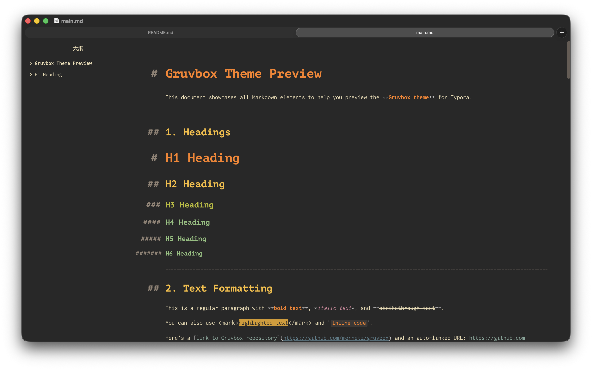
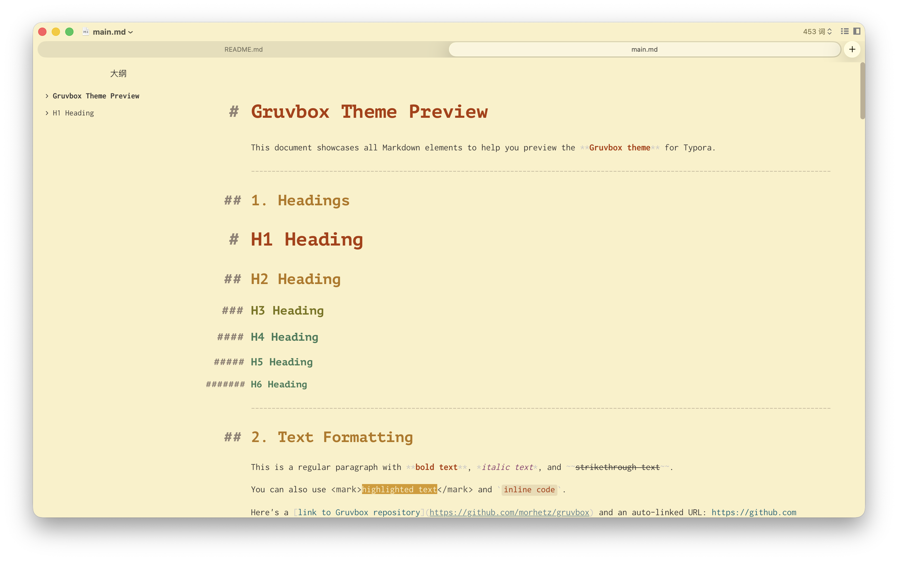

# Gruvbox for Typora

[](LICENSE)
[](https://github.com/morhetz/gruvbox)
[](https://typora.io)

> *Designed and tested on macOS. Not fully tested, but should work for Windows/Linux. But this theme does not include styles for Windows “unibody” style.*

A warm, retro groove theme for [Typora](https://typora.io), inspired by the popular [Gruvbox](https://github.com/morhetz/gruvbox) color scheme originally created by [Pavel Pertsev](https://github.com/morhetz) for Vim.

## ✨ Features

- **🎨 Two Variants**: Includes both dark (`gruvbox-dark`) and light (`gruvbox`) themes
- **🌅 Warm Color Palette**: Low contrast, eye-friendly colors based on the classic Gruvbox 16-color palette
- **🎸 Retro Groove**: Inspired by retro groove color schemes with warm yellows, oranges, and browns
- **💻 Full Syntax Highlighting**: Code blocks with complete Gruvbox syntax highlighting support
- **🎯 Carefully Tuned UI**: All UI elements styled to match the Gruvbox aesthetic
- **⚡ Optimized for Writing**: Perfect for long-form writing and note-taking

## 📸 Screenshots

### Dark Theme



### Light Theme



## 🎨 Color Palette

### Dark Theme (`gruvbox-dark`)

| Element | Color | Hex |
|:--------|:-----:|:---:|
| Background | Dark gray | `#282828` |
| Foreground | Light beige | `#ebdbb2` |
| Red | Bright red | `#fb4934` |
| Green | Bright green | `#b8bb26` |
| Yellow | Bright yellow | `#fabd2f` |
| Blue | Bright blue | `#83a598` |
| Purple | Bright purple | `#d3869b` |
| Aqua | Bright aqua | `#8ec07c` |
| Orange | Bright orange | `#fe8019` |

### Light Theme (`gruvbox`)

| Element | Color | Hex |
|:--------|:-----:|:---:|
| Background | Warm beige | `#fbf1c7` |
| Foreground | Dark gray | `#3c3836` |
| Red | Dark red | `#9d0006` |
| Green | Dark green | `#79740e` |
| Yellow | Dark yellow | `#b57614` |
| Blue | Dark blue | `#076678` |
| Purple | Dark purple | `#8f3f71` |
| Aqua | Dark aqua | `#427b58` |
| Orange | Dark orange | `#af3a03` |

## 📦 Installation

### Method 1: Manual Installation

1. Download the latest release from the [Releases](https://github.com/TwinklerG/typora-gruvbox-theme/releases) page
2. Open Typora → Preferences → Appearance → Open Theme Folder
3. Copy `gruvbox.css` and `gruvbox-dark.css` to the theme folder
4. Restart Typora
5. Select theme from the Themes menu:
   - **Gruvbox** - Light theme
   - **Gruvbox Dark** - Dark theme

### Method 2: Clone Repository

```bash
# Navigate to Typora theme directory
cd ~/Library/Application Support/abnerworks.Typora/themes/

# Clone the repository
git clone https://github.com/your-username/typora-gruvbox-theme.git gruvbox

# Copy theme files
cp gruvbox/src/*.css ./

# Restart Typora
```

### Method 3: Symbolic Link (for development)

```bash
# Navigate to Typora theme directory
cd ~/Library/Application Support/abnerworks.Typora/themes/

# Create symbolic link
ln -s /path/to/typora-gruvbox-theme/src/gruvbox.css ./gruvbox.css
ln -s /path/to/typora-gruvbox-theme/src/gruvbox-dark.css ./gruvbox-dark.css
```

## 🚀 Usage

1. Open Typora
2. Go to **Themes** menu
3. Select either:
   - **Gruvbox** - For the light variant
   - **Gruvbox Dark** - For the dark variant

## 📁 File Structure

```
typora-gruvbox-theme/
├── README.md                    # This file
├── LICENSE                      # MIT License
├── example/
│   └── main.md                  # Example Markdown file for preview
├── src/
│   ├── gruvbox.css             # Light theme
│   └── gruvbox-dark.css        # Dark theme
├── README.assets/
│   ├── gruvbox.png             # Screenshot preview
│		└── ...
│
└── _posts/theme/
    └── 2026-02-08-Gruvbox.md   # Theme submission for typora.io
```

## 🔧 Compatibility

- **Typora Version**: 1.0+
- **Platforms**: macOS, Windows, Linux
- **Features Supported**:
  - ✅ Code fences with syntax highlighting
  - ✅ Math blocks (LaTeX)
  - ✅ Tables
  - ✅ Task lists
  - ✅ Outline panel
  - ✅ Source code mode
  - ✅ Footnotes
  - ✅ Definition lists
  - ✅ Mermaid diagrams
  - ✅ All standard Markdown elements

## 📝 Example

See [`example/main.md`](example/main.md) for a comprehensive showcase of all Markdown elements styled with the Gruvbox theme.

## 🤝 Contributing

Contributions are welcome! Please feel free to submit a Pull Request.

1. Fork the repository
2. Create your feature branch (`git checkout -b feature/AmazingFeature`)
3. Commit your changes (`git commit -m 'Add some AmazingFeature'`)
4. Push to the branch (`git push origin feature/AmazingFeature`)
5. Open a Pull Request

## 📄 License

This project is licensed under the MIT License - see the [LICENSE](LICENSE) file for details.

## 🙏 Credits

- **Original Gruvbox Theme**: [Pavel Pertsev](https://github.com/morhetz) - [morhetz/gruvbox](https://github.com/morhetz/gruvbox)
- **Inspired by**: The Vim Gruvbox color scheme community
- **Adapted for Typora**: [TwinklerG]

## 🔗 Related Projects

- [Gruvbox for VS Code](https://github.com/jdinhify/vscode-theme-gruvbox)
- [Gruvbox for Sublime Text](https://github.com/Briles/gruvbox)
- [Gruvbox for iTerm2](https://github.com/herrbischoff/iterm2-gruvbox)

---

<p align="center">Made with ❤️ and ☕ using the Gruvbox color scheme</p>
